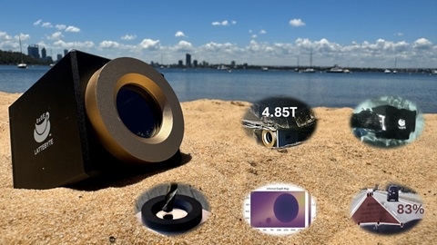
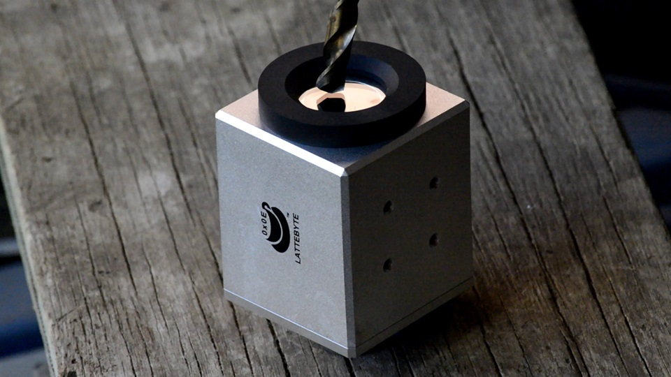

## Hi there 👋

## **[Launching Soon](https://www.kickstarter.com/projects/jz-lattebyte/distance-to-your-dream-the-sapphire-camera-for-human-and-ai/)**

  
Distance To Your Dream: The Sapphire Camera for Human & AI
Features: Remote Ops, Weatherproof, Heavy Armor, Industry Ready, Education & DIY, Industrial Realtime AI Inference Demo, Optional Sync,3D,Modular

<!--
**lattebyte/lattebyte** is a ✨ _special_ ✨ repository because its `README.md` (this file) appears on your GitHub profile.

Here are some ideas to get you started:

- 🔭 I’m currently working on ...
- 🌱 I’m currently learning ...
- 👯 I’m looking to collaborate on ...
- 🤔 I’m looking for help with ...
- 💬 Ask me about ...
- 📫 How to reach me: ...
- 😄 Pronouns: ...
- ⚡ Fun fact: ...
-->

## Table of Contents

- ### Realtime AI Visual Inference
  - **Target Detection and Positioning**
    - [Yolo Detection - Windows GPU Inference](https://github.com/lattebyte/Yolo-Detection-Windows-GPU)
    - [Detectron2 Segmentation - Windows GPU Inference - WIP]()
  - **Object Distance Estimation**
    - [Depth Pro - Windows GPU Inference](https://github.com/lattebyte/DepthPro-Windows-GPU.git)
- ### Static AI Visual Inference

  - **Object Distance Estimation**
    - [Depth Pro - Windows/MacOS CPU Image Inference](https://github.com/lattebyte/DepthPro-Windows-CPU)
    - [Depth Pro - Linux CPU Image Inference - WIP]()

- ### Interaction with the Real World
  - **Vision Interface**
    - [Industrial Open-Source USB Camera](https://github.com/lattebyte/CM16A)
